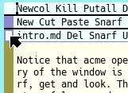

Welcome
===

Plan 9 is a fully-featured, clean, compact and uniform operating system built as a successor to Unix. As you can see the interface is fully graphical even though there is still a healthy amount of text. Virtually everything in the system exists as a file including this window, the program that runs in it and this text file. Multiple machines can work together so that they behave as a single system sharing processors, storage, peripherals and graphics. At first, you might find the system to be foreign. The aim of this tutorial is to ease you into using the system and help make you feel more at home with it. I hope that you enjoy the ride.

First, you really need a three button mouse. One with a scroll wheel will work as long as you can click the scroll wheel as the third button.

I'm probably getting close to running out of space on this window. I should probably show you how to scroll. To scroll a window in Plan 9 you can use the up/down arrow keys on the keyboard (on the bottom right corner). Try pressing the down arrow now to scroll down a few lines. Another way to scroll is to use the scroll bar on the left side of this window. If you left-click on the scroll bar near the top-left of this window it will scroll up one line at a time. Right-click to scroll down. As you click lower down on the scroll bar (left or right) it will scroll in larger and larger increments. For a very large document you can click and hold moving the mouse up/or down on the scroll bar to adjust the speed. Give it a try. Who knew that you can write an entire paragraph about scrolling?

The insertion point (little vertical bar where new text goes) can be moved around by left-clicking the mouse or using the left/right arrows on the keyboard. Text selection is done in the usual way by left-clicking and dragging. Delete a range of text by selecting it and hitting the backspace key. Overwrite it by typing over of the selection. The next paragraph is rubbish, try selecting and erasing it.

Rubbish, rubbish, rubbish, rubbish, rubbish, rubbish, rubbish, rubbish, rubbish, rubbish, rubbish, rubbish, rubbish, rubbish, rubbish, rubbish, rubbish, rubbish, rubbish, rubbish, rubbish, rubbish, rubbish, rubbish, rubbish, rubbish, rubbish, rubbish, rubbish, rubbish, rubbish, rubbish, rubbish, rubbish, rubbish, rubbish, rubbish, rubbish, rubbish, rubbish, rubbish, rubbish, rubbish, and more rubbish.

There are more interesting things that you can do with selected text. For example, you can duplicate it using Snarf (kind of like copy) and Paste. To snarf some text you select it using the mouse and middle-button click on the snarf command text at the top of this window. You can then paste it by putting the insertion point at the destination and middle-button click on the paste command. Try snarfing and pasting the bullet point below a few times.

1. I will not copy text without properly quoting the source of it.

Snarfing and pasting text is great, but what about more exciting things? There is the undo command, which will undo your last change to the document. You can probably see that there is an Undo command at the top of this window. You might be surprised to know that you can middle-click on the word Undo right here. Yes, I'm referring to the u-n-d-o word in the previous sentence. Try middle-clicking on it now to undo one of the extra lines you snarfed and pasted in the last paragraph.

Middle clicking on a word or some selected text *executes* that command. As you can see, it doesn't matter where that command is. It can be embedded in a document. If you don't trust the document then try not to execute any commands in it.

We've covered what the left and middle mouse buttons do. What about the right one? Well, that is for navigation. Right-clicking on a file can potentially open up a new window, depending on which program is registered to handle the file type. You can close windows by right-clicking on an empty spot on the desktop, choose Delete and then right click on the window. Try right-clicking on this nice introduction document written by the Plan 9 authors. Close it once you are done.

    /sys/doc/9.ps

Plan 9 opened a new window because this program (it's called acme) doesn't understand how to open PostScript and PDF files. The system located a tool that can open them. If you open text files then they will open in a new window within acme. We will try that shortly.

The windowing system is called rio. Rio exposes its window management commands in a right-click menu on the desktop. You can hide and show this window by right-clicking on the desktop, choose hide and right-click on this acme window. Once it is hidden you can bring it back by right-clicking on the desktop and picking the acme process.

You may have noticed that much of this tutorial has been focused on acme so far even though there are many other tools. Acme is really good at presenting, navigating and working with text. Much of the plan 9 system is available in text, such as text files, lists of files, output from commands and much more. As a result, acme can be a text editor, navigator, browser and history for your activities. It's a good starting point for learning about Plan 9.

Plan 9 comes with a number of good papers describing different aspects on the system ranging from an introduction to the system to the built-in unicode character set also known as UTF-8. I find myself referring to these papers frequently to understand areas of the system. Try navigating to the documents directory.

    /sys/doc

Notice that acme opened up a new window with the directory listing. The name of the subject file or directory of the window is on the top-left. The top portion of the window has convenient commands such as del, snarf, get and look. These commands have been at the top of this window the whole time, but now you can see that useful commands are added to new windows too.

Acme windows can be resized in a number of ways. You can click and drag the little resize box on the top-left corner of the window up or down to enlarge or shrink it. If you left-click on the box it will gradually increase its size. You can also maximize the window hiding all other windows. Reveal hidden windows by left-clicking on the resize box on the visible window. Maximize a window by right-clicking on the resize box. Try different sizes for the new window now.

Try opening some of the documents (PS, PNG, PDF) in the directory window. If you try opening sub-directories they open as new windows. Close windows by running the del command. Don't worry, the del command doesn't delete the file or directory. It only deletes the window. Remember, you can run commands by middle-clicking on them.

Delete all of the extra windows. You can always open them again by navigating from the path in this document or just type it somewhere and right-click on it.

While the papers are great for reading about the design of the system, sometimes you need specific and current details about the system, such as installed programs and their command-line arguments or even programming documentation. There is a built-in manual system not unlike UNIX manual pages. Let's have a quick look at the introduction.

    intro(1)

Notice that since manual pages are text they open up within acme as new windows. Manual page references are detected because of the unique format with the page name and the section number in brackets. You can even navigate from one manual page to another by right-clicking on manual page references within the manual page with a simple hyperlinking system, but without the URL's.

Speaking of hyperlinks, this page is running quite long. Let's continue in a new document and learn more about creating, editing and searching documents. Select and right-click on the file name (doced.md) below to open the next tutorial. Delete this window if you want. You may need to undo your modifications or delete it twice because of a warning window that tells you that you have unsaved changes.

[Document Editing]( doced.md )
